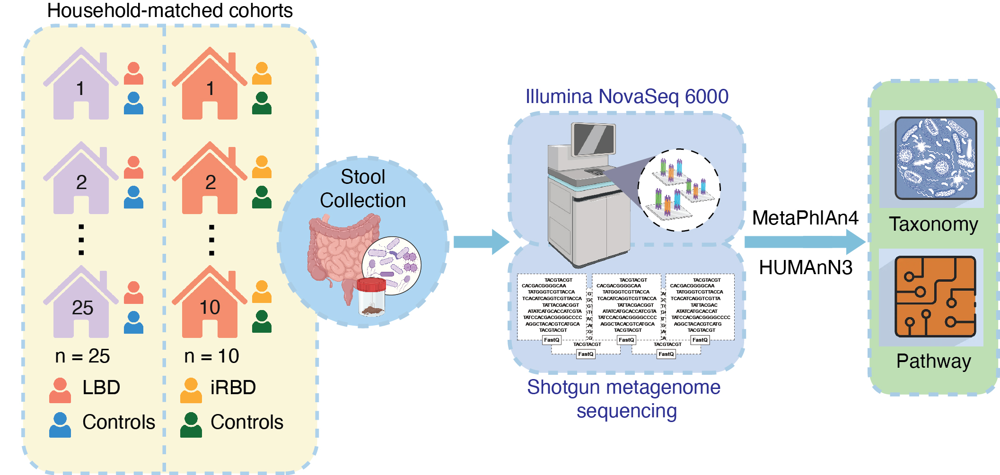

# Shotgun metagenomic analysis reveals taxonomic and functional alterations in the gut microbiome across prodromal and symptomatic Lewy body disease

**DOI:** 

**Authors:** Xiaowei Zhao, Stuart J. McCarter, Vinod K. Gupta, Kiera M. Grant, Erik K. St. Louis, Kejal Kantarci, Rodolfo Savica, Max Hill, Helen E. Vuong, Christopher Staley, Bradley F. Boeve, Owen A. Ross, Levi M. Teigen, and Jaeyun Sung

## Overview




This repository contains the R analysis code for a gut microbiome study comparing individuals with Lewy Body Dementia (LBD) and isolated REM Sleep Behavior Disorder (iRBD) against their respective household controls. Shotgun metagenomic data were profiled using MetaPhlAn (species-level taxonomy) and HUMAnN (functional pathways).

## Study Design

Four groups are compared across analyses:

| Group | Label |
|---|---|
| Lewy Body Dementia patients | `lbd` |
| LBD household controls | `lbd_control` |
| Isolated REM Sleep Behavior Disorder patients | `irbd` |
| iRBD household controls | `irbd_control` |

Comparisons: LBD vs. LBD-Control, iRBD vs. iRBD-Control, and LBD vs. iRBD.

## Repository Structure

```
0-raw_data/
    metaphlan_results_new.tsv      # Species-level relative abundance (MetaPhlAn output)
    pathway_results.tsv            # Functional pathway abundance (HUMAnN output)
    imputed_BMI_metadata.csv       # Sample metadata (condition, age, sex, BMI, clinical scores)

1-alpha_beta_diversity/
    alpha_beta_diversity_final_version.R

2-microbial_taxa_analysis/
    different_prevalence_analysis_final_version.R

3-microbial_functional_pathway_analysis/
    pathway_analysis_final_version.R
    pathway_taxonomy_analysis_final_version.R
    pathways_contributed_by_bacterial_species_final_version.R

4-correlation_analysis/
    partial_correlation_analysis.R
```

## Analysis Modules

### 1. Alpha & Beta Diversity (`1-alpha_beta_diversity/`)

- Computes Shannon index, Simpson index, inverse Simpson index, and species richness per sample
- Statistical testing via mixed-effects linear models (`lmerTest`) with household as a random effect, and Wilcoxon rank-sum tests
- Beta diversity via Bray-Curtis dissimilarity with arcsine square-root transformation; PERMANOVA (`vegan::adonis2`) stratified by household; PCoA plots with 95% confidence ellipses (`ade4`, `ggplot2`)
- Stacked bar plots of family-level relative abundance across all four groups

### 2. Microbial Taxa Analysis (`2-microbial_taxa_analysis/`)

- Differential prevalence analysis using Fisher's exact test with Benjamini-Hochberg FDR correction
- Prevalence cutoff filtering (species must be detected in ≥10% of samples)
- Heatmaps (`pheatmap`, `ComplexHeatmap`) and bar plots of significant species

### 3. Functional Pathway Analysis (`3-microbial_functional_pathway_analysis/`)

- Mixed-effects linear models to identify differentially abundant metabolic pathways
- Volcano plots of pathway effect sizes vs. significance
- Attribution of pathway abundance to contributing bacterial species (HUMAnN stratified output)

### 4. Partial Correlation Analysis (`4-correlation_analysis/`)

- Spearman partial correlations between microbial features (species and pathways) and clinical measurements (e.g., MoCA, CDR, UPDRS)
- Covariates: age, BMI
- Two-stage screen: fast parametric `pcor.test` followed by permutation-based validation

## R Package Requirements

```r
install.packages(c(
  "lmerTest", "vegan", "ade4", "ggplot2", "reshape2",
  "dplyr", "ggpubr", "tidyr", "RColorBrewer",
  "pheatmap", "ppcor", "tidyverse", "ggrepel", "purrr"
))

# Bioconductor
if (!requireNamespace("BiocManager", quietly = TRUE)) install.packages("BiocManager")
BiocManager::install("ComplexHeatmap")
```

## Data Preprocessing

All scripts apply a consistent preprocessing pipeline before statistical testing:

1. Extract species-level rows from MetaPhlAn output (rows matching `s__` but not `t__`)
2. Normalize counts to relative proportions (column sums = 1)
3. Apply an abundance cutoff of 10^-4.5 (species below this threshold in a sample are set to zero)
4. Arcsine square-root transformation for beta diversity and pathway analyses
5. Merge with sample metadata; analyses use matched case-control pairs (household ID as random effect)

## Reproducibility

PERMANOVA analyses use `set.seed(10)` before each permutation test to ensure reproducible results.
